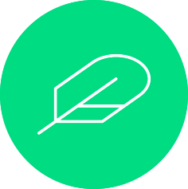

<div align="center">

</div>
<h1 align="center">Nuxt Feather Icons</h1>
<p align="center">Support for Nuxt 3</p>
<br>

<div align="center">


[![Static Badge][npm-src]][npm-href]
[![Static Badge][github-src]][github-href]
[![npm version][npm-v-src]][npm-v-href]
![GitHub License][license]
[![Nuxt][nuxt-src]][nuxt-href]
[![npm downloads][npm-d-src]][npm-d-href]
[![Static Badge][sponsor-src]][sponsor-href]

</div>

## Install

```bash
npm i nuxt-feather-icons
```

```bash
yarn add nuxt-feather-icons
```

## Usage

### nuxt.config.js

``` js
modules: [
    'nuxt-feather-icons'
],
```

## Sizing

<p>Os ícones são dimensionados automaticamente com base no tamanho da fonte do elemento pai por padrão.</p>
<br/>
<p>No entanto, se desejar um tamanho personalizado, você pode utilizar o atributo size. Para dimensionamento com base em
múltiplos, especifique o múltiplo desejado seguido do caractere x.</p>

<br/>

<p>Icons are automatically sized based on the font size of the parent element by default.</p>
<p>However, if you wish to customize the size, you can use the size attribute. For sizing based on multiples, specify the
desired multiple followed by an x.</p>

```html

<XIcon size="1.5x" class="custom-class"></XIcon>
```

<p>Além disso, é possível definir um tamanho absoluto em pixels (px) simplesmente passando um número inteiro.</p>
<p>Additionally, you can set an absolute size in pixels (px) by simply passing an integer.</p>

```html

<XIcon size="30" class="custom-class"></XIcon>
```

<p>Essa flexibilidade permite que você ajuste facilmente o tamanho dos ícones conforme suas necessidades específicas.</p>
<p>This flexibility allows you to easily adjust the icon size according to your specific needs.</p>

## ⚖️ License

Released under [MIT](/LICENSE) by [@4slan](https://github.com/4sllan).

[npm-src]: https://img.shields.io/badge/NPM:nuxt-feather-icons?style=flat-square&colorA=18181B&colorB=28CF8D

[npm-href]:https://www.npmjs.com/package/nuxt-feather-icons

[github-src]: https://img.shields.io/badge/GITHUB:nuxt-feather-icons?style=flat-square&colorA=18181B&colorB=28CF8D

[github-href]: https://github.com/4sllan/nuxt-feather-icons

[npm-v-src]: https://img.shields.io/npm/v/nuxt-feather-icons/latest.svg?style=flat-square&colorA=18181B&colorB=28CF8D

[npm-v-href]: https://www.npmjs.com/package/nuxt-feather-icons

[license]: https://img.shields.io/github/license/4sllan/nuxt-feather-icons?style=flat-square&colorA=18181B&colorB=28CF8D

[nuxt-src]: https://img.shields.io/badge/Nuxt-18181B?logo=nuxt.js

[nuxt-href]: https://nuxt.com

[npm-d-src]: https://img.shields.io/npm/dt/nuxt-feather-icons.svg?style=flat-square&colorA=18181B&colorB=28CF8D

[npm-d-href]: https://www.npmjs.com/package/nuxt-feather-icons

[sponsor-src]: https://img.shields.io/badge/-%E2%99%A5%20Sponsors-ec5cc6?style=flat-square

[sponsor-href]:https://github.com/sponsors/4sllan